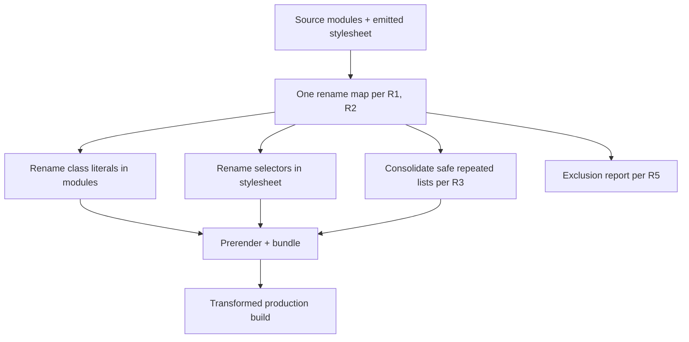
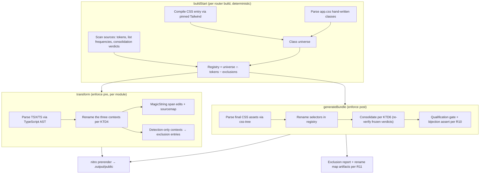

# Tailwind Classname Transform - Plan

## Goal Capsule

- **Objective:** Ship a production-build Vite plugin that renames Tailwind classes to short, stable content-hash names — rename plus list consolidation — on jonkwheeler.com, with pixel-identical rendering and a realized byte win.
- **Product authority:** This document. Byte-delta baselines and exclusion semantics are inherited from `docs/plans/2026-08-08-001-feat-tailwind-classname-compression-plan.md`.
- **Execution profile:** Unit-ordered implementation (U1–U7); each unit lands as an atomic commit with its test scenarios green.
- **Stop conditions:** The comparison harness (R7) fails on any prerendered route; the qualification gate (R10) cannot be satisfied against the installed Tailwind/Vite versions; the realized whole-site Brotli delta is zero or negative after rename lands.
- **Tail ownership:** The dogfood run (U7) and the PR description's measured numbers are owned by the final unit; deferred follow-ups are listed in Scope Boundaries.
- **Open blockers:** None.

---

## Product Contract

Product Contract preservation: changed — R1 and R5 clarified (rename contexts pinned to three syntactic forms; computed names corrected to the documented blind spot); R9–R11 added (off-switch, fail-loud integrity, persisted artifacts); Success Criteria measurement paths clarified; Outstanding Questions resolved during planning (hash policy → KTD5, cascade insertion → KTD6, plugin ordering → KTD1/KTD2, harness mechanism → KTD8). Document-review amendments: R3 excludes variant-carrying lists from consolidation (R6 clarification); R9 flag semantics pinned (consolidation implies rename); KTD3/KTD4/KTD6/KTD7/KTD8/KTD9 sharpened from review findings. No scope change.

### Summary

A Vite plugin, private to this repo, that renames Tailwind classes to short stable content-hash names during production builds. It rewrites class literals in source modules and selectors in the emitted stylesheet with one shared map, so prerendered HTML and hydration JS stay consistent by construction. It performs both rename and list consolidation, never touches dev output, and skips-with-warning any class usage it cannot prove safe.

### Problem Frame

Developers write Tailwind, but the shipped DOM carries the cost: class attributes like `mx-auto min-h-screen max-w-162.5` are noisy to read in DevTools and view-source, and they repeat across every page and every hydration bundle.

The measurement CLI (`tools/minwind`) quantified both the opportunity and the hazard on this site. The opportunity: renaming classes tops out at about 5.7% of whole-site Brotli bytes (91,877 → 86,656). The hazard: 100% of HTML-used class-token bytes also appear as string literals in SolidStart's hydration bundles, so any transform that rewrites only the emitted HTML breaks the client-side app. A transform on this stack must rename at a level where HTML, CSS, and JS all inherit the new names — or rewrite all three consistently.

### Key Decisions

- **Production-only transform; dev keeps readable classnames.** Debugging happens in dev, where names are intact; no decode map ships. (session-settled: user-approved — chosen over shipping a decode map or a DevTools layer: the standard minification posture already fits how the maintainer works.) Governs R4.
- **Rename at the source-module level via a Vite plugin.** Prerendered HTML and hydration bundles compile from the same source modules, so one rename propagates everywhere by construction. (session-settled: user-approved — chosen over post-build output rewriting: rewriting minified JS bundles is the highest-risk surgery and duplicates the measurement tool's machinery.) Governs R1, R6.
- **Skip-and-warn exclusion posture.** Unprovable class usage is left untouched and reported per build. (session-settled: user-approved — chosen over fail-the-build and silent skipping: the build should succeed with full visibility, not break or hide.) Governs R5.
- **Both rename and consolidation in v1.** Maximum DOM cleanliness and compression, accepting consolidation's harder correctness surface. (session-settled: user-directed — chosen over rename-only: the consolidation win is part of the point, not a later increment.) Governs R3.
- **Content-hash generated names.** Each class's name is a short hash of its original name, stable across builds. (session-settled: user-approved — chosen over sequential names: sequential reshuffles the whole mapping on any style edit and cache-busts every asset.) Governs R2.
- **Dogfood scope: this site is the only supported consumer in v1.** Generalization follows proven end-to-end success, not precedes it. (session-settled: user-approved — chosen over a general-purpose plugin from day one: one real site constrains the design honestly.)

### Requirements

**Transform behavior**

- R1. Production builds apply one consistent rename map — original class name to short generated name — to class literals in source modules and to class selectors in the emitted stylesheet, covering Tailwind utilities and site-defined classes (custom `@utility` names and plain classes defined in the site's stylesheet). Source-side rewriting is pinned to exactly three syntactic contexts: `class="..."` JSX attributes, `classList={{...}}` object keys, and `cn(...)` call arguments; arbitrary string literals are never rewritten (this site displays Tailwind class strings as blog article content).
- R2. Generated names are short content hashes of the original class name; an unchanged class keeps its name across builds, and identical inputs produce identical names.
- R3. Class lists that repeat across elements consolidate into shared rules where the merge is provably semantics-preserving per R6; lists containing complex-subject utilities (e.g. `space-x`, `divide`), lists whose members carry variant prefixes or at-rule contexts (e.g. `hover:`, `focus:`, `md:` — their declarations apply under a pseudo-class or media query, so folding them into one unconditional rule would apply them at rest), or cascade-risky insertions are excluded from consolidation and still renamed per R1. Lists composed at runtime across call sites (e.g. `cn('mb-16', props.class)`) are unprovable and excluded from consolidation.
- R4. Development builds are never transformed; classnames in dev output remain the original readable names.

**Safety and fidelity**

- R5. Class usage the transform cannot prove safe — runtime-injected classes (e.g. the `dissolve-*` overlay classes), classes not defined in the site's stylesheet — is left byte-identical and listed in a per-build exclusion report. Computed class names are a documented blind spot: they cannot be detected statically, so they are covered by the no-computed-class-strings convention (see Dependencies / Assumptions), not by the report.
- R6. Transformed output renders identically to untransformed output: variants, cascade order, and specificity relationships are preserved.

**Verification**

- R7. A comparison harness builds the site twice — transform off and transform on — and gates on pixel-identical rendering of every prerendered page.
- R8. The transform runs cleanly against the jonkwheeler.com production build and produces transformed output plus the exclusion report.

**Operability**

- R9. An environment flag disables the transform entirely, with sub-flags for rename and consolidation; because consolidation operates on renamed rules (KTD6), the consolidation flag is meaningful only when rename is on. The default is fully on for production builds. The comparison harness (R7) and emergency disable use the same flag.
- R10. The transform fails the build loudly on any internal error, hash collision, or emitted-stylesheet shape divergence; half-transformed output never ships. Skip-and-warn per R5 applies only to class-usage classification, never to internal failures.
- R11. The rename map and the exclusion report are persisted as build artifacts outside the deployed public directory, so a hash name seen in production can be decoded without rebuilding.

### Key Flows

- F1. Transformed production build
  - **Trigger:** The production build runs with the plugin enabled.
  - **Steps:** At build start the plugin establishes the class universe and scans sources (KTD3); per module it renames class literals (R1); at bundle time it renames stylesheet selectors and consolidates provably safe repeated lists (R3); prerendering proceeds on transformed modules; the build writes the exclusion report and rename map (R5, R11).
  - **Outcome:** A production build whose HTML, CSS, and JS all carry the short names, plus a visible list of everything left untouched.
  - **Covered by:** R1, R2, R3, R5, R11
- F2. Unprovable class usage
  - **Trigger:** The transform encounters class usage it cannot prove safe (runtime-injected, not in the stylesheet).
  - **Steps:** The usage is skipped byte-identical; the exclusion report records it; the build completes.
  - **Outcome:** Safe classes are renamed; unsafe ones are preserved and visible.
  - **Covered by:** R5



### Acceptance Examples

- AE1. Given a production build, when a prerendered page's HTML is inspected, then class attributes contain short hash names and no original utility names remain for provably safe usage — while a dev build of the same page shows the original names. **Covers R1, R4.**
- AE2. Given the dissolve overlay's runtime-injected `dissolve-*` classes, when the production build runs, then those classes are byte-identical in the output and named in the exclusion report. **Covers R5.**
- AE3. Given two production builds of the site — transform off and transform on — when every prerendered page is compared, then rendering is pixel-identical and hydration completes without errors. **Covers R6, R7.**
- AE4. Given a repeated class list containing a complex-subject utility such as `space-x-*`, when consolidation runs, then that list is not merged into a shared rule and its classes are still renamed. **Covers R3.**
- AE5. Given the transform disabled via the environment flag, when a production build runs, then its output is byte-identical to a build with the plugin absent. **Covers R9.**
- AE6. Given an emitted stylesheet whose shape diverges from the expected Tailwind v4 shape (e.g. after an upgrade), when the bundle-time pass runs, then the build fails with a clear error instead of shipping mis-renamed CSS. **Covers R10.**

### Success Criteria

- Zero hydration errors and fully working interactions (theme, animations, page transitions) on the transformed production build, verified by the harness's interaction smoke pass.
- Median class-attribute length in prerendered HTML drops by at least half versus the untransformed build, measured by the comparison harness over `.output/public`.
- Whole-site Brotli delta on the transformed output is positive and approaches the measured upper bound of ~5.7% (91,877 → 86,656 bytes), measured by `tools/minwind`; the realized number lands below the bound by construction (the bound assumed shortest-first names; R2's hashes are fixed-length) and is recorded in the PR description.
- Reproducibility: the same source and toolchain produce byte-identical transformed site files (the deployed files under `.output/public`) across runs.

### Scope Boundaries

**Deferred for later**

- Generalizing or publishing the plugin — config surface, other frameworks, other sites.
- A DevTools decode layer or class sourcemap for production debugging (R11's persisted map covers the manual case).
- Evaluating or adopting prior art (e.g. `unplugin-tailwindcss-mangle`) as a replacement for the from-scratch plugin.
- A multi-site compression benchmark using `tools/minwind`.

**Deferred to follow-up work**

- Repointing `tools/minwind`'s golden fixture from the stale `dist/` to `.output/public`, and deleting `dist/`.
- An ESLint rule banning computed class strings (the convention is documented in Dependencies / Assumptions; enforcement is follow-up).
- CI wiring for the comparison harness (no CI exists in this repo; the harness is a local gate).
- Baseline-diffing of the exclusion report to spotlight new entries.

**Outside this product's identity**

- A CSS minifier — Lightning CSS already minifies stylesheet content; this transform renames selectors and merges rules.
- Modifying source files on disk — the rename happens in the build pipeline; the working tree is never rewritten.
- Transforming third-party or runtime-injected classes — they are excluded per R5, never chased.

### Dependencies / Assumptions

- Assumption: "more performant" means bytes over the wire; the transform makes no runtime-CSS performance claims.
- Assumption: all class usage is reachable as static literals in source modules — verified 2026-08-09: 92 `class=` usages across 9 `src/**/*.tsx` files; 6 `cn()` call sites whose ternary branches are all string literals; `props.class` passthroughs are caller-supplied literals renamed at each call site per R1.
- Assumption: Shiki syntax-highlighting classes (`shiki`, `min-dark`, `line`) are not Tailwind candidates and do not appear in the emitted stylesheet, so they fall into the R5 skip bucket and highlighting is unaffected.
- Convention (adopted, enforcement deferred): class strings are never constructed at runtime; runtime class toggles use excluded prefixes only (the `dissolve-*` pattern). This convention covers the computed-names blind spot in R5.
- Dependency: Tailwind v4 CSS-first setup via `@tailwindcss/vite`; SolidStart prerender through `vinxi build` (prefixed by the `gen:code-highlights` codegen step).
- Dependency: `tools/minwind` provides the byte-delta baseline and the exclusion semantics this transform inherits.

### Sources / Research

- `docs/plans/2026-08-08-001-feat-tailwind-classname-compression-plan.md` — the measurement plan; this plan activates its deferred "transform application" and "Vite plugin adapter" scope boundaries.
- `tools/minwind/test/golden/dist-report.json` — the measured baseline: 100% of HTML-used class-token bytes are JS-referenced; upper-bound rename delta ≈ 5.7% of whole-site Brotli. Note: the fixture was captured against `dist/`, which a current `vinxi build` no longer produces; the realized delta is re-measured against `.output/public` (see Scope Boundaries).
- Prior art: `tailwindcss-obfuscator`, `unplugin-tailwindcss-mangle`, Classpresso, UnoCSS `compile-class` — partial overlaps; none do list consolidation, and none are proven against SolidStart prerendering.
- Repo grounding (verified 2026-08-09): class usage distribution, `cnfast` usage, `src/utils/dissolve.ts` runtime classes, Tailwind v4 CSS-first config, `app.config.ts` prerender setup.
- Build-pipeline research (2026-08-09): Tailwind's Vite plugin scans source files from disk (transforms never affect candidate extraction); SolidStart places user plugins before `vite-plugin-solid`, so an `enforce: 'pre'` transform sees raw TSX; Vite 6.4.1 emits no CSS sourcemaps in build; nitro emits prerendered HTML after the Vite builds close; vinxi runs three router builds (ssr, client, server-fns) with separate plugin instances.

<!-- ce-section: work-relationships -->

### How This Work Fits Together

This plan owns one area: the real classname transform for jonkwheeler.com. The broader breakdown below is current understanding, not a committed roadmap.

- The measurement CLI (`tools/minwind`, plan at `docs/plans/2026-08-08-001-feat-tailwind-classname-compression-plan.md`) — this transform **depends on** its findings (the JS-duplication hazard shaped the source-level approach) and **shares** its exclusion semantics; its deferred transform/Vite-plugin scope is this plan's active scope.
- A DevTools decode layer — **depends on** this transform shipping; **still to decide** whether it is needed at all, given production-only renaming keeps dev readable.
- A general-purpose published plugin — **depends on** dogfooding success here.
- A multi-site benchmark — **can proceed independently**, using `tools/minwind` as-is.

---

## Planning Contract

### Key Technical Decisions

- KTD1. **Rename in raw TSX, before Solid's JSX compile.** An `enforce: 'pre'` transform hook parses modules with the TypeScript compiler API and edits via MagicString spans, returning real sourcemaps. SolidStart inserts user plugins before `vite-plugin-solid`, so class contexts are still syntactically explicit; post-compile, classes live inside `template()` HTML literals, a worse grammar. (session-settled: user-approved — chosen over post-Solid compiled-JS matching: raw TSX keeps the three rename contexts syntactically explicit.) Governs R1, R4.
- KTD2. **Rename stylesheet selectors in `enforce: 'post'` `generateBundle`, via css-tree span edits.** The final CSS asset exists only at bundle time (post-minification, all code-split assets visible); a `transform`-hook edit would run pre-minify across many modules. css-tree with positions preserves byte fidelity outside edits and reuses `tools/minwind`'s selector modeling. (session-settled: user-approved — chosen over a CSS-module transform hook: one post-minification point sees every asset.) Governs R1, R6.
- KTD3. **A `buildStart` pre-pass establishes the class universe; the registry is universe ∩ rename-context tokens − exclusions, and the CSS side renames exactly the registry.** The pre-pass compiles the CSS entry once with the site's own Tailwind version (pinned `@tailwindcss/node`) to learn which classes the stylesheet will define, parses `src/app.css` for hand-written classes and `@utility` names, and scans all source modules for class-context tokens and list frequencies. This resolves the ordering hole: the `pre` transform runs before the stylesheet exists, and consolidation needs global list knowledge before any module transforms. Consolidation groups and their KTD6 safety verdicts are computed in this same pre-pass against the pre-pass-compiled stylesheet and frozen; the source transform applies the frozen verdicts, and the `generateBundle` pass re-verifies them against the emitted stylesheet, failing the build per R10 on divergence. The registry invariant makes every R5 skip safe by construction — a skipped token is absent from the registry, so its selector keeps its original name. (Rejected alternative: deriving the universe from a previously emitted stylesheet — it couples correctness to a prior artifact and breaks clean-build determinism.) Governs R1, R5.
- KTD4. **Rename contexts are exactly three syntactic forms; detection-only contexts feed the exclusion report.** Renamed: `class="..."` attributes, `classList={{...}}` keys, `cn(...)` arguments. Detected but never renamed: literals in `classList.add/remove/toggle` and `className` assignments (the runtime-injection pattern, e.g. `dissolve-*`). Both `.ts` and `.tsx` modules are scanned, so AE2's `dissolve.ts` entries are reported. A token appearing in any unprovable class context (e.g. a template literal with expressions) is excluded from the registry entirely, so mixed provable/unprovable usage keeps the original name everywhere. Governs R1, R5.
- KTD5. **Hash scheme: whole-token input (variant included), CSS-ident-safe alphabet, fixed length, hard-error collision policy.** `hover:border-accent` hashes as one token; the pseudo-class stays in the CSS. Names match `[a-z][a-z0-9]*` so no CSS escaping or JS quoting is needed. The registry asserts a bijection at bundle time; any collision (hash-vs-hash, or hash-vs-excluded-name) fails the build per R10 and the length is bumped. (session-settled: user-approved — chosen over sequential names: stable per-class names avoid whole-map reshuffles.) Governs R2.
- KTD6. **Consolidation safety rule: merge only identical declaration-sets, only within the utilities layer, only when no intervening rule declares any merged property, and only for variant-free lists.** Neither first- nor last-occurrence placement is universally safe across an intervening overlapping rule, so those groups are excluded per R3. Lists whose members carry variant prefixes or at-rule contexts are excluded per R3 — a variant member's declarations apply under a pseudo-class or media query, and folding them into one unconditional rule would apply them at rest. The consolidated class name hashes the sorted list; the shared rule replaces the merged rules at the earliest merged position. Sequenced after rename, so consolidation operates on already-short names. Governs R3, R6.
- KTD7. **Fail-loud integrity posture.** Any internal error (parse failure, span mismatch), registry collision, or stylesheet-shape divergence fails the build via `this.error`; R5's skip-and-warn covers usage classification only. Half-transformed output never ships. Two concrete tripwires: a production build with a non-empty registry that applies zero source renames fails (the KTD1 plugin-ordering assumption broke); reverse-leak warnings stay warnings — they can fire on intentional content strings, e.g. article code samples — and are included in the exclusion report. Governs R5, R10.
- KTD8. **Comparison harness: local-only, two clean builds, static serve, network blocked, computed-style equality primary.** Build off vs. on into separate directories from `.output/public`; serve statically; crawl every prerendered page with Playwright; block external requests (Google Fonts) for determinism; disable animations and wait for settle; compare per-element computed styles exactly (deterministic, names the offending property), with screenshot comparison at a small tolerance as the secondary tier; capture console errors for hydration. After the comparison tiers, an interaction smoke pass toggles the theme and performs one client-side navigation per route, asserting zero console errors and the expected DOM mutations — this is the harness's check for the "fully working interactions" success criterion. Governs R7.
- KTD9. **Deterministic across vinxi's three router builds.** SolidStart passes the same plugin objects to the ssr, client, and server-fns builds (verified against @solidjs/start 1.2.1), so all per-build state is initialized in `buildStart` and never accumulated in factory closures; content-hash names (KTD5) make every build produce the identical map. The exclusion report and rename map (R11) carry deterministic content, so concurrent router writes are first-writer-wins. Governs R2, R8.

### High-Level Technical Design

The plugin is one factory returning two plugin objects, plus a shared pre-pass. It runs inside each of vinxi's three router builds; determinism replaces coordination.



Consolidation decision sketch (directional, not implementation specification):

```text
for each group of rules with identical declaration-sets in the utilities layer:
  if any member carries a variant or is a complex-subject utility: skip group
  if any rule between the group's first and last positions declares
     any property the group declares: skip group
  else: emit one shared rule at the group's earliest position,
     named by hash of the sorted member list
```

### Assumptions

Recorded without interactive confirmation (pipeline run); each is a scope-level bet reviewable at the PR:

- The tool lives at `tools/minwind/`, mirroring `tools/minwind` conventions: private `"type": "module"` package, exact-pinned deps, own lockfile, Node 22.14.0 engines pin, root script aliases, no ESLint/gitignore changes needed under `tools/**`.
- `vite` is added as the tool's devDependency pinned to 6.4.1 (vinxi's resolved version) for plugin types; `magic-string`, `css-tree`, `@tailwindcss/node`, and `@tailwindcss/oxide` (both exact-pinned to the site's Tailwind 4.1.18 — they are transitive-only under pnpm and not resolvable from the tool package otherwise) are tool dependencies; the harness uses the `playwright` package (not `playwright-core`) so browser binaries provision via its postinstall — the harness's one heavy devDependency.
- "Pixel-identical" (R7) is implemented as exact per-element computed-style equality on every prerendered route, with screenshot comparison as a secondary tier — stronger and more deterministic than raw pixels alone.
- The comparison harness is a local gate run via a root script; no CI exists to wire it into.
- The byte-stability success criterion is scoped to the deployed site files under `.output/public`; nitro's own metadata files carry a build date and are excluded.
- `dist/` is a stale artifact of a prior toolchain; all harness and measurement work targets `.output/public`. Repointing `tools/minwind`'s golden fixture is follow-up on the measurement branch.
- The ssr build emits a second, unreferenced CSS asset (`_server/assets/`); both CSS assets are renamed identically by the same `generateBundle` pass.
- Asset filename hashes reflect pre-rename bytes (Rollup finalizes asset names at emit time). This is cache-safe because the rename is a deterministic bijection of the content; verified during U4.

### Implementation Constraints

- Follow `tools/minwind` conventions: `node:test` + `node:assert` suites run via tsx from the repo root, one fixture directory per scenario, `node:`-prefixed imports, no arrow functions, `import process from 'node:process'`, prettier no-semicolon style.
- The root tsconfig has no `include`/`exclude` and covers `tools/**`; do not add a nested tsconfig.
- The plugin never writes to the working tree; build artifacts (report, map) land outside `public/` and `.output/public/` and are gitignored.
- Keep the plugin a pure Vite plugin — no vinxi or SolidStart imports — so it survives the announced vinxi sunset.

### Risks & Dependencies

| Risk / Dependency                                                        | Mitigation                                                                                                                    |
| ------------------------------------------------------------------------ | ----------------------------------------------------------------------------------------------------------------------------- |
| Tailwind emitted-shape drift on upgrade silently mis-renames CSS         | Qualification gate fails the build (R10, AE6); `@tailwindcss/node` exact-pinned to the site's version                         |
| Hash collision between two classes or with an excluded name              | Bijection assertion fails the build (KTD5); ~126 classes in a 26·36³ space makes this near-impossible, and loud if it happens |
| Computed class strings introduced later bypass detection (R5 blind spot) | Documented convention (Dependencies / Assumptions); ESLint rule is deferred follow-up                                         |
| Consolidation flips cascade on an intervening overlapping rule           | KTD6 property-overlap check; AE4; harness computed-style diff catches residue                                                 |
| vinxi is officially sunset                                               | Plugin is pure Vite (Implementation Constraints); router-build determinism via KTD9                                           |
| Playwright adds a heavy devDependency for a local-only gate              | Scoped to the tool package; harness is the R7 gate, not optional polish                                                       |
| SSR build emits a duplicate unreferenced CSS asset                       | Renamed identically by the same pass (Assumptions); byte accounting notes it                                                  |

---

## Output Structure

```text
tools/minwind/
  package.json            # private, type: module, node 22.14.0 pin, exact deps
  src/
    names.ts              # content-hash naming + bijection registry (KTD5)
    prepass.ts            # buildStart universe + source scan (KTD3)
    transform-source.ts   # enforce-pre TSX/TS rename (KTD1, KTD4)
    transform-css.ts      # generateBundle CSS rename + qualification gate (KTD2, KTD7)
    consolidate.ts        # shared-rule synthesis (KTD6)
    report.ts             # exclusion report + rename map artifacts (R5, R11)
    plugin.ts             # factory: two plugin objects + flags (R9)
  test/
    *.test.ts             # node:test suites
    fixtures/             # one directory per scenario
  harness/
    compare.ts            # two-build comparison gate (KTD8)
```

---

## Implementation Units

### U1. Naming and registry core

- **Goal:** Deterministic content-hash naming with a bijection-asserting registry and the exclusion classification model.
- **Requirements:** R2, R5, R10
- **Dependencies:** None.
- **Files:** `tools/minwind/package.json`, `tools/minwind/src/names.ts`, `tools/minwind/test/names.test.ts`
- **Approach:**
  1. Scaffold the package per the minwind conventions (Implementation Constraints).
  2. Implement the hash-name function per KTD5: whole-token input, `[a-z][a-z0-9]*` alphabet, fixed default length.
  3. Implement the registry: token → name, name → token, with collision detection across renamed and excluded names.
  4. Implement the exclusion classifier: runtime-injection contexts, not-in-universe tokens, configured prefixes, and in-universe classes absent from source tokens (css-only).
- **Patterns to follow:** `tools/minwind/src/span-edit.ts` name-allocation alphabet; `tools/minwind/src/exclusions.ts` category model.
- **Test scenarios:**
  - Happy path: known tokens (`flex`, `hover:border-accent`, `[&_pre]:p-4`, `max-w-162.5`) produce ident-safe names matching `[a-z][a-z0-9]*`.
  - Stability: the same token hashes identically across two registry instances (KTD9 determinism).
  - Edge: tokens differing only in variant (`border-accent` vs `hover:border-accent`) get distinct names.
  - Error path: a forced collision (stubbed hash) raises the hard-error policy per R10; a generated name colliding with an excluded name (`dissolve-reduced`) also raises it.
  - Edge: excluded-prefix tokens (`dissolve-*`, `shiki`, `line`, `min-dark`) classify as excluded and never enter the rename side of the registry.
- **Verification:** Suite green; naming is deterministic across processes.

### U2. buildStart pre-pass

- **Goal:** Establish the class universe and the source token inventory before any transform runs, producing the registry per KTD3.
- **Requirements:** R1, R3, R5
- **Dependencies:** U1.
- **Files:** `tools/minwind/src/prepass.ts`, `tools/minwind/test/prepass.test.ts`, `tools/minwind/test/fixtures/prepass-site/`
- **Approach:**
  1. Compile the CSS entry in memory with the pinned `@tailwindcss/node` (API verified against the installed 4.1.18): `compile(cssString, { base: dirname(cssEntry), shouldRewriteUrls: true, onDependency: noop })` — there are no `loadStylesheet`/`loadModule` options in 4.1.18; loading is built in.
  2. Scan candidates with `new Scanner({ sources })` from `@tailwindcss/oxide`, mirroring `@tailwindcss/vite`'s own source computation: `compiler.root === 'none'` → no auto source; `null` → `{ base: projectRoot, pattern: '**/*', negated: false }`; otherwise the compiler's root — then concat `compiler.sources`.
  3. Call `compiler.build(candidates)` once (the compiled object is stateful and single-shot) and parse the returned stylesheet string with css-tree for class selectors — this is the only enumeration that includes hand-written classes, `@utility` output, and `@source inline()` safelists, and it matches the Vite plugin's own pipeline by construction.
  4. Scan all source modules (`src/**/*.{ts,tsx}`) with the TypeScript AST: collect rename-context tokens (KTD4), detection-only tokens, and class-list frequencies for consolidation.
  5. Build the registry: universe ∩ rename-context tokens − exclusions (including KTD4's unprovable-context poisoning rule); record excluded tokens with reasons.
  6. Compute consolidation groups and their KTD6 safety verdicts against the pre-pass-compiled stylesheet; freeze them for the source transform (KTD3).
- **Approach note:** The Tailwind compile learns the class universe only; the site's own build still produces the shipped CSS (KTD2). `@tailwindcss/node` and `@tailwindcss/oxide` are transitive-only under pnpm and must be direct deps of the tool package, exact-pinned to 4.1.18.
- **Test scenarios:**
  - Happy path: a fixture site with utilities, a custom `@utility`, and a plain class yields a registry containing all three.
  - Edge: a source token with no stylesheet rule (e.g. `dissolve-reduced` in a `classList.add` call) is excluded with its reason recorded.
  - Edge: a stylesheet class never used in source does not enter the registry (css-only).
  - Integration: list frequencies span multiple fixture modules, proving the scan is global rather than per-module.
  - Error path: a Tailwind compile failure raises the fail-loud policy per R10.
- **Verification:** Suite green; registry contents match fixture expectations exactly.

### U3. Source-module transform

- **Goal:** Rename class literals in the three syntactic contexts across `.ts`/`.tsx` modules, with sourcemaps and reverse-leak detection.
- **Requirements:** R1, R4, R5, R10
- **Dependencies:** U1, U2.
- **Files:** `tools/minwind/src/transform-source.ts`, `tools/minwind/test/transform-source.test.ts`, `tools/minwind/test/fixtures/source-modules/`
- **Approach:**
  1. Implement the `enforce: 'pre'` transform handler per KTD1: TypeScript AST walk, MagicString span edits, real sourcemap return, `null` when unchanged. The hook filters to `src/**/*.{ts,tsx}` (node_modules excluded); `cn(...)` calls are identified by import-traced binding (callee identifier bound to the `cn` import), falling back to a bare-name match.
  2. Rewrite only the KTD4 contexts; route detection-only literals to the exclusion report.
  3. After editing each module, whole-word scan the original source for remaining registry tokens and warn with locations (reverse-leak check).
  4. Any parse or span failure raises per KTD7.
- **Test scenarios:**
  - Covers AE1 (source half). Happy path: `class="mx-auto min-h-screen"`, `classList={{ 'text-sm': cond }}`, and `cn('mb-16', props.class)` rename through the registry.
  - Happy path: every ternary branch in a multiline `cn()` call renames (the `bookmarks.tsx` shape).
  - Edge: a template literal with expressions in a class context is skipped and reported, never partially rewritten.
  - Edge: string literals outside the three contexts — including article-content strings containing utility names — are byte-identical after transform.
  - Detection: `classList.add('dissolve-reduced')` in a `.ts` module is reported and not renamed (Covers AE2 source half).
  - Error path: a registry token remaining in the edited module outside rename contexts produces a warning naming the location.
  - Integration: the returned sourcemap maps renamed spans back to original positions (hires boundary mapping).
- **Verification:** Suite green; a transformed fixture module differs only at expected spans.

### U4. Stylesheet transform

- **Goal:** Rename class selectors in the final emitted CSS assets, gated and asserted per KTD2 and KTD7.
- **Requirements:** R1, R6, R10
- **Dependencies:** U1, U2.
- **Files:** `tools/minwind/src/transform-css.ts`, `tools/minwind/test/transform-css.test.ts`, `tools/minwind/test/fixtures/css-assets/`
- **Approach:**
  1. In `enforce: 'post'` `generateBundle`, parse each `.css` asset with css-tree positions; rename class selectors whose decoded name is in the registry — candidates and marker references alike (`.group` inside `:where()`).
  2. Span-edit only; never reserialize (KTD2).
  3. Run the qualification gate before editing: utilities layer present, selectors decodable; divergence raises per R10.
  4. Assert the registry bijection against the final CSS; assert exact per-class presence — every registry name appears as a renamed selector in at least one final CSS asset; assert no registry token survives as a whole word in any asset. All three assertions fail the build per R10.
- **Test scenarios:**
  - Happy path: minified fixture CSS with plain, variant (`hover\:`), arbitrary (`[\&_pre]\:`), and `:where()`-nested selectors renames exactly the registry members.
  - Edge: selectors outside the registry (hand-written unlayered classes not in source) keep original names.
  - Edge: already-minified input (no whitespace, Lightning CSS output shape) parses and edits cleanly.
  - Error path: a stylesheet missing the utilities layer fails the build (Covers AE6).
  - Error path: a surviving whole-word registry token after editing fails the build.
  - Integration: the ssr build's two CSS assets (the referenced asset and its `_server/assets/` duplicate) are renamed identically.
- **Verification:** Suite green; edited assets differ only at selector spans.

### U5. Consolidation

- **Goal:** Merge provably safe repeated class lists into shared rules, on top of rename.
- **Requirements:** R3, R6
- **Dependencies:** U1, U2, U3, U4.
- **Files:** `tools/minwind/src/consolidate.ts`, `tools/minwind/test/consolidate.test.ts`, `tools/minwind/test/fixtures/consolidate/`
- **Approach:**
  1. From the pre-pass list frequencies, take lists used more than once; drop lists containing complex-subject utilities or variant-carrying members per R3.
  2. Apply the KTD6 safety rule in the pre-pass against the compiled stylesheet (frozen verdicts, KTD3); re-verify against the emitted stylesheet at bundle time and fail per R10 on divergence.
  3. Synthesize the shared rule at the group's earliest position; collapse source-side lists to the consolidated name in the same modules U3 edits.
  4. Consolidated names hash the sorted list per KTD6; they live in the same registry and bijection checks.
- **Test scenarios:**
  - Covers AE4. Happy path: a list repeated across three elements merges into one shared rule; each element's class attribute carries the consolidated name.
  - Edge: a repeated list containing `space-y-4` is excluded from merging but still renamed per token.
  - Edge: a repeated list whose members carry variants (`focus:border-accent`, `placeholder:text-light-dim` — the bookmarks.tsx input shape) is excluded from merging but still renamed per token.
  - Edge: two lists with the same members in different orders consolidate to the same name (sorted-list hashing).
  - Error path: a group with an intervening rule sharing a property is skipped; the stylesheet keeps per-utility rules.
  - Integration: consolidation composed with rename leaves the registry bijection intact.
- **Verification:** Suite green; merged output preserves declaration order and cascade position per KTD6.

### U6. Plugin wiring, flags, and artifacts

- **Goal:** The two-plugin factory, `app.config.ts` registration, the R9 off-switch, and the R11 report/map artifacts.
- **Requirements:** R4, R8, R9, R11
- **Dependencies:** U1–U5.
- **Files:** `tools/minwind/src/plugin.ts`, `tools/minwind/src/report.ts`, `tools/minwind/test/plugin.test.ts`, `app.config.ts`, root `package.json`, root `.gitignore`
- **Approach:**
  1. Implement the factory returning the source and CSS plugins; read the R9 flags from the environment; default fully on for `apply: 'build'`.
  2. Register in `app.config.ts` after `tailwindcss()`; keep the plugin pure-Vite (Implementation Constraints).
  3. Write the exclusion report and rename map to `.output/minwind/report.json` and `.output/minwind/map.json` (gitignored, outside the deployed tree); content is deterministic, so concurrent router writes are first-writer-wins (KTD9). Enforce the KTD7 zero-rename tripwire at `closeBundle`.
  4. Add root script aliases for the tool and the harness.
- **Test scenarios:**
  - Covers AE5. Happy path: a programmatic fixture build with the plugin enabled renames; with the flag off, output is byte-identical to no-plugin.
  - Happy path: dev-mode (`apply` gate) leaves modules untouched.
  - Edge: rename-off/consolidate-on and rename-on/consolidate-off flag combinations behave independently.
  - Integration: three simulated router builds produce identical registries and one report file (KTD9).
  - Error path: a flag value outside the supported set fails fast with a clear message.
  - Error path: a simulated production build with a non-empty registry and zero applied renames fails (the KTD7 plugin-ordering tripwire).
- **Verification:** Suite green; the site's own `pnpm build` completes with the plugin registered and writes both artifacts.

### U7. Comparison harness and dogfood run

- **Goal:** The R7 gate — two-build comparison harness — plus the measured dogfood run on the real site.
- **Requirements:** R6, R7, R8
- **Dependencies:** U1–U6.
- **Files:** `tools/minwind/harness/compare.ts`, `tools/minwind/test/harness.test.ts`, root `package.json`
- **Approach:**
  1. Implement the harness per KTD8: clean builds off and on, static serve, Playwright crawl of every prerendered page discovered in `.output/public`, network blocked, animations disabled, computed-style diff primary, screenshot secondary, console-error capture for hydration — then the KTD8 interaction smoke pass (theme toggle, one client-side navigation per route, zero-console-error assertion).
  2. Measure median class-attribute length and whole-site Brotli delta (via `tools/minwind` pointed at `.output/public`).
  3. Self-test the harness: a deliberately broken transform fixture must fail the gate.
  4. Run the dogfood: harness green on every route; record the realized numbers for the PR.
- **Test scenarios:**
  - Covers AE3. Happy path: off vs. on builds of a fixture site compare equal on computed styles and produce zero console errors.
  - Error path: a fixture with an intentionally mis-renamed rule fails the computed-style diff and names the property.
  - Edge: a page with `@starting-style` entry animations compares equal after the settle policy.
  - Integration: the interaction smoke pass toggles the theme and navigates client-side on a fixture page, failing on any console error.
  - Integration: the harness discovers pages from `.output/public` rather than a hardcoded list, including the sitemap route without prerendered HTML as a reported gap.
- **Verification:** Suite green; the dogfood run passes on every prerendered route and the realized Brotli delta is positive.

---

## Verification Contract

| Gate                        | Command                                                                | Proves                                         |
| --------------------------- | ---------------------------------------------------------------------- | ---------------------------------------------- |
| Setup                       | clean root `pnpm install`, then `pnpm install` inside `tools/minwind/` | toolchain baseline (mirrors the minwind setup) |
| Unit and integration suites | `pnpm tsx --test "tools/minwind/test/**/*.test.ts"` from the repo root | U1–U7 test scenarios                           |
| Repo checks                 | `pnpm check` (typecheck + lint + format, covers `tools/**`)            | Implementation Constraints                     |
| Comparison gate             | root harness script (added in U6/U7)                                   | R6, R7, AE3                                    |
| Dogfood run                 | `pnpm build` with the plugin registered, then the harness              | R8, AE1, AE2, AE5                              |
| Byte delta                  | `pnpm tw:measure .output/public` on the transformed build              | Success Criteria                               |

The test gate uses a quoted glob, not a directory argument — tsx 4.21 treats a directory as an entry point and fails, and Node 22's directory scan does not match `.ts` files (both verified against the repo's toolchain).

The dogfood run's exit criterion is a green comparison gate plus a complete exclusion report — not a particular byte number. A positive but modest delta still ships; a zero or negative delta after rename lands is a stop condition (Goal Capsule).

---

## Definition of Done

- All seven units landed; every unit's test scenarios pass.
- `pnpm check` passes with `tools/**` covered.
- The comparison harness passes on every prerendered route: computed styles equal, screenshots within tolerance, zero hydration errors.
- The exclusion report contains only expected entries (`dissolve-*`, Shiki classes, css-only classes) and is persisted with the rename map outside the deployed tree.
- The realized whole-site Brotli delta and median class-attribute length are recorded in the PR description.
- Dev builds and the working tree are untouched; `pnpm format` on source still shows original classnames.
- Abandoned-attempt code (spike scripts, alternate parser experiments) is removed from the diff.
- Every R-ID traces to at least one unit; every AE is covered by a named test scenario or a Verification Contract gate.

---

## Deferred Findings (post-review residual record)

Accepted residuals from the five-reviewer code review (2026-08-09, run 20260809-190124-72822ced). Each was triaged and consciously not fixed in this branch:

- **Resting-state, single-viewport gate** (review #15, advisory): the comparison harness verifies resting-state rendering at one viewport. Hover/focus-only and responsive-breakpoint-specific transform bugs would pass. Mitigation: variants are renamed uniformly inside selectors, and the interaction smoke pass exercises the theme toggle. A mobile-viewport pass and post-interaction re-snapshot are natural harness hardening later.
- **Singleton plugin BuildState** (review #4, validator-dropped): `minwind()` keeps one BuildState slot; interleaved router-build lifecycles would clobber it. Verified unreachable under vinxi 0.5.10 (router builds are awaited sequentially in one worker). Revisit if vinxi parallelizes builds.
- **Scanner-mirror drift**: the pre-pass mirrors `@tailwindcss/vite` 4.1.18's source computation; `@tailwindcss/node`/`oxide` are pinned exactly but `@tailwindcss/vite` is `^4.1.18`, so a lockfile-refresh minor bump can invalidate the mirror. Expected failure mode is loud (presence/consolidation divergence at build time).
- **Whole-word sweep heuristic**: `assertNoSurvivingTokens` can false-positive on registry tokens inside declaration values (e.g. `content: 'flex'` from a `content-['flex']` utility), failing the build loudly. Safe direction; calibrate if it fires. **Resolved 2026-08-10**: it fired — Tailwind's automatic content detection harvested `content-['flex']` from this very document, and the escaped arbitrary-value selector text tripped the sweep. The text sweep was replaced with a parsed surviving-selector assertion: only a class selector in an all-registry arm counts as a survivor, so declaration values, at-rule preludes, and escaped arbitrary-value selector text are out of scope by construction, while mixed-compound and css-only arms (which keep original bytes by design) stay exempt.
- **Prerendered-pages-only comparison**: server functions, API routes, and non-prerendered responses are outside the gate; JS/HTML assets are not swept for surviving registry tokens.
- **`/src/` substring module filter**: a future linked workspace package under a matching path would be transformed against the site's registry. No linked packages exist today.
