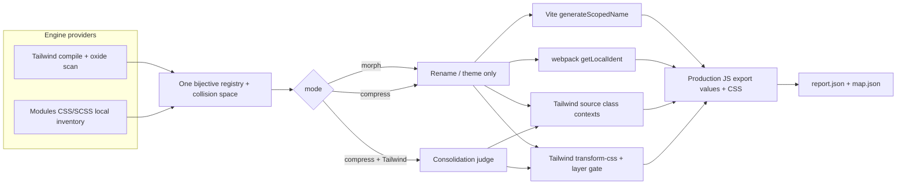

# feat: Multi-engine styling support with morph/compress modes

## Goal Capsule

**Objective.** Let production builds morph classnames for CSS/SCSS Modules (and keep Tailwind) under the same bijective safety contract, with an explicit morph-only vs compress mode so theme renaming does not require consolidation.

**Authority.** `AGENTS.md` invariants and `docs/architecture.md` outrank this plan on safety. README fit/compatibility claims update with the public surface. `docs/design-plan.md` is historical only.

**Done when.** A Modules fixture site builds with owned scoped names matching JS export values; morph mode never consolidates; Modules-only compress coerces to morph with a loud warning; dual-stack compress consolidates Tailwind only; dual Tailwind+Modules builds do not fail the utilities-layer gate on Modules assets; StyleX / Vanilla Extract / Panda are documented follow-up stubs only; `pnpm check` green and Modules compare harness (or written N/A) covered.

**Out.** Atomic CSS Modules decomposition; implementing StyleX / Vanilla Extract / Panda adapters; post-build `apply` for Modules.

---

## Product Contract

### Summary

minwind stays a production-only, fail-loud classname morpher with one registry across surfaces. This milestone extends Tailwind-only support to Tailwind plus CSS/SCSS Modules (Vite PostCSS Modules and webpack css-loader), exposes morph vs compress so users can theme-rename without property-moving consolidation, and documents StyleX / Vanilla Extract / Panda as follow-up stubs only. Modules v1 value is bijective rename/theme and JS↔CSS sync—not consolidation savings (those remain Tailwind-primary).

### Problem Frame

Authors on CSS Modules (and later StyleX / Vanilla Extract / Panda) want the same production classname morph — especially themed vocabularies — without adopting Tailwind. Consolidation / property-moving is optional and often undesirable for Modules debugging. The current pipeline hardcodes Tailwind compile, `@layer utilities` qualification, and string-class contexts, so non-Tailwind projects cannot opt in safely.

### Actors

- A1. App developer integrating minwind into Vite or webpack/rspack.
- A2. Production build consumer (browser) — must see matching JS export values and CSS selectors.
- A3. Debugger of production CSS — may prefer morph without consolidation.

### Key Flows

- F1. Modules-only Vite production build with morph + themed naming: scoped export values and selectors share registry names; source keeps `styles.local` keys.
- F2. Tailwind-only build with `mode: "compress"`: today’s rename + consolidation behavior.
- F3. Dual Tailwind + Modules build: both engines rename into one generated-name space; Tailwind assets keep utilities-layer qualification; Modules assets use naming-hook path.
- F4. Modules-only build with compress: coerces to morph with a loud warning; dual-stack compress consolidates Tailwind only and reports Modules skips.
- F5. Unprovable / global Modules usage: `:global` and unresolved `composes` do not silently desync exports and CSS.

### Requirements

#### Engines and adapters

- R1. CSS Modules and SCSS Modules are supported end-to-end on Vite (PostCSS Modules) and webpack/rspack (`css-loader` modules) production builds via the bundler’s scoped-name generation hook (not by rewriting `styles.foo` keys, not by post-hash regex mangling). Vite Lightning CSS Modules is unsupported in this milestone (fail loud if Modules is enabled and the hook is not applied).
- R2. Tailwind remains a first-class engine; existing Vite / webpack / apply paths keep current semantics for Tailwind-only projects.
- R8. Modules-only projects do not require a Tailwind CSS entry or `@tailwindcss/*` compile path.

#### Mode and naming

- R3. User-facing mode distinguishes morph (rename/theme only) from compress (rename plus consolidation where the engine supports it). Env flags may remain as lower-level overrides with existing fail-fast contradictions. Modules-only builds that select compress coerce to morph with a loud report warning (dual-stack: Tailwind may still consolidate; Modules reports engine-unsupported skips).
- R15. Modules morph supports `naming.strategy` `hash` and `words` with file-qualified registry identity; `words` requires a complete Modules inventory and fails if incomplete. `quotes` remains list-driven and may no-op for Modules-only usage.

#### Registry and safety

- R4. One bijective registry across all renamed surfaces in a build; collisions and partial transforms fail the build. Modules locals are rename-eligible by definition-site ownership (inventory), not by Tailwind’s source∩universe predicate.
- R5. Unprovable usage preserves the original token (or Modules local identity) globally; classification uncertainty skips with a report reason.
- R6. `:global` selectors and `composes … from global` are never morphed through the Modules naming hook.
- R7. Unresolved or inconsistent `composes` fails the build rather than shipping desynced exports.
- R9. Dual-engine projects share one generated-name collision space and separate classification universes per engine.

#### Boundaries and docs

- R10. Post-build `apply` remains Tailwind-oriented; Modules via `apply` is unsupported and documented as such in this milestone.
- R11. StyleX, Vanilla Extract, and Panda are research stubs / altitude notes only — no production adapters in this plan.
- R12. Atomic decomposition of CSS Modules into shared utilities is out of scope.
- R13. Development builds remain untouched.
- R14. Public docs (README fit matrix, options, peer deps) reflect engines, modes, PostCSS vs Lightning, and that Modules value is rename/theme sync not consolidation.

### Acceptance Examples

- AE1. Covers F1 / R15. A Vite (PostCSS Modules) app with `Button.module.css` exporting `root` builds with morph + `naming.strategy: "words"`; `styles.root` value equals the scoped class in emitted CSS; export key remains `root`.
- AE1b. Covers R1. A webpack/rspack Modules production build under morph: a local export value matches the emitted CSS selector (parallel to AE1; hash naming sufficient).
- AE2. Covers F2. Existing Tailwind fixture with compress still consolidates safe repeated lists and writes consolidation verdicts.
- AE3. Covers F3. A site with Tailwind utilities and a `*.module.css` local named `flex` does not fail because Modules CSS lacks `@layer utilities`; both engines emit non-colliding generated names.
- AE4. Covers F4 / R3. Modules-only + compress coerces to morph with a loud warning; dual-stack + compress consolidates Tailwind where safe and reports Modules consolidation skips.
- AE5. Covers F5. A module using `:global(.external)` leaves `.external` unchanged; a broken `composes` fails the build.
- AE6. Covers R1. Enabling Modules engine under Vite Lightning CSS Modules (hook not applied) fails the build with an actionable error.

### Scope Boundaries

#### In scope

- Engine provider seam; Tailwind behind it; CSS/SCSS Modules v1.
- Morph / compress mode surface and report flags.
- Vite `css.modules.generateScopedName` and webpack `css-loader` `modules.getLocalIdent` ownership (or equivalent documented hooks).
- Dual-stack qualification policy for `transform-css`.
- Packaging: Tailwind peer optional when only Modules is enabled.
- Follow-up stubs for StyleX / Vanilla Extract / Panda in architecture docs.

#### Deferred for later

- StyleX / Vanilla Extract / Panda production adapters.
- Modules support in `minwind apply` and measure arms.
- Modules list consolidation / property-moving compress beyond rename.
- Atomic CSS Modules compiler.
- Lightning CSS Modules parity beyond fail-loud when custom naming cannot be applied.

#### Outside this product's identity

- Runtime styling libraries.
- Becoming a general CSS minifier or PostCSS optimizer.
- Guessing dynamic class references.

### Key Decisions

- KD1. Modules morph owns bundler scoped-name generation so JS export values and CSS selectors stay in sync by construction. Governs R1.
- KD2. Morph vs compress is a first-class mode. Modules-only compress coerces to morph with a loud warning; dual-stack compress consolidates Tailwind only and reports Modules skips. Governs R3, R4.
- KD3. Registry identity for Modules is file-qualified local name (repo-relative path + local), not bare local spelling; Modules locals are rename-eligible by inventory ownership. Governs R4, R9, R15.
- KD4. StyleX / VE / Panda stay stubs; atomic Modules compiler stays out. Governs R11, R12.
- KD5. Primary wedge is Modules morph (theme/rename) for PostCSS Modules / css-loader; dual-stack coexistence is in-milestone but sequenced after hash-hook proof. Governs R1, R9.

---

## Planning Contract

### Assumptions

- Confirmed scoping: CSS/SCSS Modules first; other engines sequenced stubs; morph/compress user-facing; atomic Modules out.
- Vite PostCSS Modules path (not Lightning-only) is the primary Vite proof surface; if Modules engine is enabled and the active toolchain cannot honor the naming hook, the build fails (R1, AE6).
- SCSS Modules stay in-milestone when prepass can compile with `sass` (optional peer) aligned to bundler order; without Sass, SCSS+`words` fails closed.
- Hash-only Modules morph via naming hooks is the first proof slice; `words` and the shared engine-provider extraction land once AE1/AE1b pass on hash.
- Themed `words` naming is in scope for Modules morph after inventory is proven; `quotes` list spelling remains Tailwind/list-driven and may no-op for Modules-only usage.

### Key Technical Decisions

- KTD1. After hash-hook Modules morph is fixture-proven (AE1/AE1b), introduce an engine provider with a shared rename/universe surface (engine id, css-entry requirements, `buildUniverse`, collision participation) and an optional Tailwind-only consolidation extension. Keep Tailwind as the default provider behind `runPrepass`. Rationale: proving the altitude first avoids sunk-cost provider extraction; a shared seam is still required before dual-stack and optional Tailwind peers. Rejected: boolean `cssModules: true` forever; rejected: extracting the provider before any Modules fixture is green.
- KTD2. Modules rename altitude is `generateScopedName` / `getLocalIdent` (plus `getJSON` where useful for reports). Do not rewrite export keys; do not post-mangle hashed locals as the primary path. Rationale: the bundler already emits selectors and JS export values from one generator; owning that callback preserves bijection by construction. Rejected: post-hash regex manglers and pre-rewriting local names.
- KTD3. Modules registry keys are normalized repo-relative `modulePath + "\0" + localName` (POSIX separators, case preserved as on disk). Generated names participate in one process-wide collision set with Tailwind-generated names. Modules inventory locals are rename-eligible by definition-site ownership even with no class-context `sourceTokens`; Tailwind keeps source∩universe / css-only. Rationale: bare local spelling collides across files; today’s `createNameRegistry` would otherwise classify all Modules locals as `css-only`.
- KTD4. `mode: "morph" | "compress"` maps to rename-on + consolidate-off / rename-on + consolidate-on for Tailwind. Modules-only compress coerces to morph with a loud warning; dual-stack compress consolidates Tailwind only. Preserve `MINWIND_*` env resolution; explicit env consolidate/rename overrides mode when set. Report `flags` include mode.
- KTD5. Split CSS qualification: Tailwind assets that reference registry Tailwind tokens still require `@layer utilities`; Modules-emitted CSS that only carries Modules-generated names skips that gate. Owning the naming hook means Modules typically needs no second `transform-css` pass; if a pass remains, it must not apply the Tailwind gate. Dual-stack also skips running consolidation judges against Modules-only assets.
- KTD6. Modules never claims consolidation success in v1; coerce or skip per KTD4. Rationale: `consolidate.ts` heuristics are Tailwind-shaped.
- KTD7. `hash` may derive from file+local on the fly at the naming hook (first proof path). `words` requires a bundler-faithful inventory: compile `*.module.scss` with optional peer `sass` before extraction; prove nested locals match hook inputs in fixtures. If `naming.strategy` is `words` and inventory is incomplete or Sass cannot run when SCSS modules exist, fail the build — no hash-fallback for words. Filesystem walk alone is insufficient for words.
- KTD8. `minwind apply` documents Modules as unsupported; no Modules apply implementation in this plan.
- KTD9. Package.json: make `tailwindcss` / `@tailwindcss/*` optional when engines exclude Tailwind; optional `sass` peer when SCSS Modules + words inventory is used; document the matrix in README.

### High-Level Technical Design

Adapter matrix (v1):

| Integration     | Tailwind                                   | CSS/SCSS Modules                                        | Dual                                   |
| --------------- | ------------------------------------------ | ------------------------------------------------------- | -------------------------------------- |
| Vite plugin     | prepass + transform-source + transform-css | own `css.modules.generateScopedName`; inventory prepass | both columns; layer gate Tailwind-only |
| webpack plugin  | loader + processAssets CSS                 | own `modules.getLocalIdent`                             | both columns                           |
| `minwind apply` | supported                                  | unsupported (document)                                  | Tailwind-only apply                    |

### Alternative Approaches Considered

- **Hash-only Modules morph via naming hooks first (no provider, no words)** — Adopted as the first proof milestone (KD5 / KTD1 sequencing): validate AE1/AE1b before extracting the engine provider or enabling `words` inventory.
- **Post-hash rewrite of emitted locals** — Rejected as primary: duplicates Modules work, fragile across Lightning vs postcss-modules export shapes, high false-positive risk.
- **Pre-rewrite local names in source CSS/JS** — Rejected: breaks `styles.foo` keys and `composes` references.
- **Partitioned registries without shared collision space** — Rejected: short theme words could collide across engines in one document.

### Risks and Dependencies

| Risk                                                   | Mitigation                                                                                             |
| ------------------------------------------------------ | ------------------------------------------------------------------------------------------------------ |
| Vite Lightning CSS Modules ignores `css.modules` hooks | Fail loud when Modules engine enabled and hook not applied; document PostCSS Modules as supported path |
| Dual-stack `@layer utilities` hard-fail                | KTD5 per-asset qualification                                                                           |
| Themed naming without full Modules inventory           | KTD7: fail the build when `words` inventory is incomplete or Sass cannot compile SCSS modules          |
| Another plugin already owns `getLocalIdent`            | Document ordering; fail if minwind cannot install its generator when Modules enabled                   |
| PeerDep / install weight for Modules-only users        | KTD9 optional Tailwind deps                                                                            |

### Open Questions

- OQ1 (deferred). Exact public option names (`engines`, `mode`) — settle during U1 against README clarity; not launch-blocking.
- OQ2 (deferred). Whether `quotes` should gain a Modules-specific multi-export story later — out of v1 behavior guarantees.
- OQ3 (deferred). SFC `<style module>` beyond `*.module.*` files — include if the same Vite/webpack hook covers it with no extra altitude; otherwise follow-up.

### System-Wide Impact

- Developers: new options and fit matrix; Tailwind users get mode alias without behavior change when compress remains default.
- Packaging: optional Tailwind peers.
- Ops/CI: Modules fixture in compare harness increases CI surface.
- Follow-on engines: stubs prevent ad-hoc altitude inventing later.

### Sources and Research

- Local: `AGENTS.md`, `docs/architecture.md`, `src/prepass.ts`, `src/plugin.ts`, `src/transform-css.ts`, `src/class-contexts.ts`, `src/names.ts`, `src/consolidate.ts`, `src/naming.ts`.
- External (load-bearing): CSS Modules / ICSS semantics; Vite `css.modules.generateScopedName`; webpack `css-loader` `getLocalIdent`; Lightning CSS Modules pattern gaps; StyleX / Vanilla Extract `identifiers` / Panda hash+codegen altitudes for stubs.
- No `docs/solutions/` or `CONCEPTS.md` corpus present.

---

## Implementation Units

Suggested execution order (U-IDs are stable, not rank): U1 → U4 (hash morph proof) → U3 (`words`/SCSS inventory) → U2 (provider extraction) → U5 → U6 → U7.

### U1. Mode surface and report flags

**Goal:** Expose morph vs compress as the user-facing control while preserving env flag semantics.

**Requirements:** R3, R14

**Dependencies:** None

**Files:**

- Modify: `src/plugin.ts`, `src/webpack.ts`, `src/apply-cli.ts`, `src/report.ts`, `src/report-cli.ts`, `src/index.ts`
- Test: `test/plugin.test.ts`, `test/webpack.test.ts`, `test/apply.test.ts`

**Approach:**

1. Add `mode?: "morph" | "compress"` (default compress to preserve today’s on-by-default consolidation).
2. Map morph → consolidate off; compress → consolidate on; keep `MINWIND_RENAME` / `MINWIND_CONSOLIDATE` overrides and rename-off+consolidate-on fail-fast.
3. Persist mode on report flags; document mapping in README in U7.

**Patterns to follow:** `resolveFlags()` in `src/plugin.ts`.

**Test scenarios:**

- Morph option yields rename with empty/absent consolidation verdicts on a Tailwind fixture that would otherwise consolidate.
- Compress option matches prior default consolidate-on behavior on the same fixture.
- Env `MINWIND_CONSOLIDATE=off` overrides mode compress (KTD4).
- Modules-only + compress coerces to morph and records a loud warning (AE4).
- Rename-off + consolidate-on still throws.

**Verification:** Unit tests green; report JSON shows mode.

---

### U2. Engine provider seam; Tailwind behind it

**Goal:** Make prepass universe construction engine-pluggable without changing Tailwind-only behavior.

**Requirements:** R2, R8

**Dependencies:** U4 (hash-hook Modules morph proven on fixtures)

**Files:**

- Create: `src/engines/types.ts`, `src/engines/tailwind.ts` (names flexible)
- Modify: `src/prepass.ts`, `src/plugin.ts`, `src/webpack.ts`, `src/apply.ts`
- Test: `test/prepass.test.ts`, new `test/engines/tailwind-provider.test.ts` if split helps

**Approach:**

1. Define a shared rename/universe provider surface (engine id, css-entry requirements, `buildUniverse`, collision participation) plus an optional Tailwind-only consolidation extension (stylesheet model / judges). Modules implements only the shared rename path in v1.
2. Move current `@tailwindcss/node` + oxide scan path into the Tailwind provider.
3. Options select engines; default remains Tailwind-only for backward compatibility.
4. Modules-only must skip Tailwind compile (fail clearly if Tailwind selected without entry).

**Execution note:** Do not extract the provider until U4 AE1/AE1b are green on hash naming. Keep Tailwind golden prepass fixtures green across the extraction.

**Patterns to follow:** `runPrepass` orchestration in `src/prepass.ts`.

**Test scenarios:**

- Default options: identical rename set to pre-change Tailwind fixture.
- Tailwind engine without readable cssEntry fails with actionable error.
- Selecting only Modules does not call `@tailwindcss/node` (mock or spy).

**Verification:** Existing `test/prepass.test.ts` and plugin fixtures still pass.

---

### U3. CSS/SCSS Modules universe and registry identity

**Goal:** Discover module locals and register file-qualified identities for bijective naming.

**Requirements:** R1, R4, R5, R6, R9, R15

**Dependencies:** U4 (can land inventory helpers alongside U4; provider wiring in U2)

**Files:**

- Create: `src/engines/css-modules.ts` (or equivalent), helpers for local extraction
- Modify: `src/names.ts` as needed for encoded keys vs display tokens and definition-site rename eligibility
- Test: `test/engines/css-modules.test.ts`, `test/names.test.ts`

**Approach:**

1. For hash-first proof, naming-hook can assign `hash(file+local)` without a full prepass inventory.
2. For `words`, discover `*.module.css` / `*.module.scss` under the configured root; compile SCSS with optional peer `sass` before local extraction; fixture-prove nested locals match hook inputs.
3. Register file-qualified keys per KTD3 as rename-eligible by definition-site ownership (do not require class-context `sourceTokens`); record `:global` / global composes as exclusions.
4. If `words` and inventory incomplete or Sass missing when SCSS modules exist, fail per KTD7.
5. Encode map.json originals as readable file-qualified strings for humans while keeping bijection on the encoded key.

**Patterns to follow:** Exclusion reasons pattern in `src/names.ts`; report visibility for skips.

**Test scenarios:**

- Two files both exporting local `button` receive distinct generated names.
- `:global(.x)` does not enter the rename set.
- Words strategy assigns vocabulary without colliding with an excluded name.
- Empty module file yields no renames and no crash.

**Verification:** Dedicated unit tests; no adapter wiring required yet.

---

### U4. Vite and webpack Modules naming hooks

**Goal:** Own scoped-name generation so export values and selectors share registry names (first proof milestone).

**Requirements:** R1, R13, R15

**Dependencies:** U1 helpful for mode warnings but not required for hash morph; U3 helpers may land in parallel

**Files:**

- Modify: `src/plugin.ts`, `src/webpack.ts` (and loader only if needed for config injection)
- Test: `test/plugin.test.ts`, `test/webpack.test.ts`
- Create: `test/fixtures/modules-site/` (minimal Vite and webpack fixtures)

**Approach:**

1. When Modules engine enabled, install Vite `css.modules.generateScopedName` and webpack `modules.getLocalIdent` wrappers that return registry-generated names for file-qualified locals (start with on-the-fly `hash`).
2. Preserve export keys; ensure composed export values are space-separated generated names for composed locals.
3. Production-only: do not install the morphing generator outside production builds (bundler keeps its default scoped names in dev).
4. If hook installation is impossible (conflicting config / Vite Lightning CSS Modules ignoring `css.modules`), fail the build when Modules engine is enabled — do not silently fall back (AE6).
5. Prefer mutating/merging user `css.modules` / `css-loader` modules options so existing `localsConvention` is preserved; only the name generator is owned.

**Patterns to follow:** Existing enforce-pre / production-only adapter lifecycle. Tripwire: when Modules engine enabled and rename-eligible locals exist, fail if zero generator calls produced registry names. All-excluded inventories may produce zero renames without failing.

**Execution note:** Land AE1/AE1b on hash before U2 provider extraction and before U3 `words` inventory.

**Test scenarios:**

- Covers AE1. Vite fixture: JS export value matches CSS selector for a local class with words or hash (hash sufficient for first green).
- Covers AE1b. webpack fixture: same export/CSS sync under morph.
- `composes: other from './other.module.css'` export list matches both generated names.
- Dev / non-production path does not install the morphing generator.
- Covers AE6. Lightning / missing-hook situation fails loudly.

**Verification:** Fixture integration tests; `pnpm compare` when harness site ready (U7).

---

### U5. Dual-stack CSS qualification and Tailwind path coexistence

**Goal:** Tailwind `@layer utilities` gate and Modules naming path coexist in one build.

**Requirements:** R2, R9

**Dependencies:** U2, U4

**Files:**

- Modify: `src/transform-css.ts`, `src/plugin.ts`, `src/webpack.ts`, possibly `src/css-util.ts`
- Test: `test/transform-css.test.ts`, `test/plugin.test.ts`
- Fixture: dual-stack addition under `test/fixtures/`

**Approach:**

1. Teach CSS rewrite/qualification which assets are Tailwind-shaped vs Modules-emitted.
2. Keep assertPresence / utilities-layer requirement for Tailwind assets that reference Tailwind registry tokens.
3. Ensure Modules-generated names are not expected inside `@layer utilities`.
4. Shared collision detection across both universes when assigning generated names.

**Test scenarios:**

- Covers AE3. Dual fixture with Modules local `flex` and Tailwind `flex` builds successfully with distinct generated names.
- Tailwind-only regression: missing `@layer utilities` still fails when Tailwind tokens were renamed.
- Modules-only asset never fails the utilities-layer assert.

**Verification:** Unit + fixture tests green.

---

### U6. Unhappy paths: globals, composes, apply boundary, Modules compress report

**Goal:** Lock fail/poison/skip semantics and honest compress reporting for Modules.

**Requirements:** R5, R6, R7, R10

**Dependencies:** U3, U4, U1

**Files:**

- Modify: Modules engine + report reason enums; `src/apply.ts` / CLI messaging; README notes in U7
- Test: `test/engines/css-modules.test.ts`, `test/apply.test.ts`, adapter tests

**Approach:**

1. `:global` / `composes from global` → never morph via Modules hook (AE5).
2. Unresolved `composes` → build failure.
3. Compress + Modules-only → coerce to morph + loud warning (AE4); dual-stack → Tailwind consolidate + Modules skip reason.
4. `apply` with Modules engine requested → hard unsupported error.

**Test scenarios:**

- Covers AE4, AE5.
- Dynamic `styles[key]` does not require export-key rewrite; no false poison solely from member expression when altitude is naming-hook-only (characterize and lock).
- Apply path documents/errors for Modules engine request.

**Verification:** Tests encode the unhappy-path table; no silent desync.

---

### U7. Packaging, docs, follow-up engine stubs, harness proof

**Goal:** Ship honest public contract and proof surface; leave breadcrumbs for StyleX / VE / Panda.

**Requirements:** R11, R14, R8

**Dependencies:** U1–U6

**Files:**

- Modify: `package.json`, `README.md`, `docs/architecture.md`
- Create: short stub section or `docs/engines-followups.md` for StyleX / Vanilla Extract / Panda altitudes
- Modify/create: `harness/` site or `test/fixtures/modules-site` wired to `pnpm compare` if feasible
- Test: docs claims covered by fixtures already added; harness test if compare site exists

**Approach:**

1. PeerDep matrix: Tailwind required for Tailwind engine; Modules-only install path documented.
2. README: fit table row for CSS/SCSS Modules; mode; apply unsupported for Modules; themed naming works with Modules morph.
3. Architecture: engine provider + Modules altitude diagram; stub follow-ups (StyleX babel/unplugin hash identity; VE `identifiers` fn; Panda codegen hash/prefix).
4. Compare harness for Modules fixture or explicit written N/A if harness cannot host Modules yet.

**Test expectation:** none for prose-only stubs — fixture/harness coverage is the proof; README examples must match tested options.

**Verification:** `pnpm check`; compare or documented N/A; packaging install story sanity-checked.

---

## Verification Contract

- Narrow during implementation: targeted files under `test/engines/`, `test/prepass.test.ts`, `test/transform-css.test.ts`, `test/plugin.test.ts`, `test/webpack.test.ts`.
- Before finish: `pnpm check`.
- Output-surface / adapter / naming / exclusion changes: `pnpm compare` against Modules (and dual) fixture, or a written reason harness is N/A.
- Acceptance mapping: AE1/AE1b/AE6 → U4; AE2 → U1; AE3 → U5; AE4/AE5 → U6.

## Definition of Done

- All U1–U7 goals met; AE1, AE1b, AE2–AE6 covered by tests or harness.
- Tailwind-only default path unchanged in behavior at compress default.
- Modules morph keeps `styles.*` keys and syncs export values with CSS.
- Modules-only compress coerces to morph with warning; dual-stack Tailwind compress still consolidates where safe.
- Docs and peer deps match the shipped surface.
- StyleX / VE / Panda are stubs only; atomic Modules compiler not started.
- No launch-blocking open questions remain (OQ1–OQ3 deferred).
