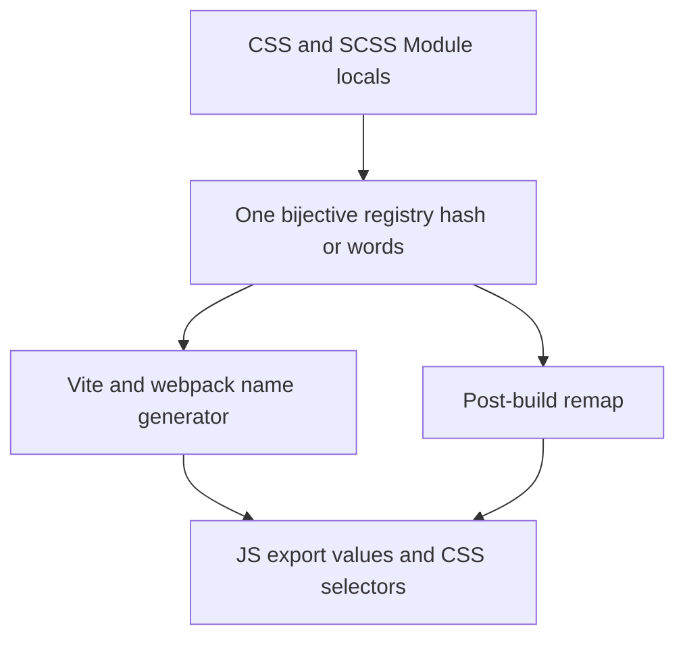
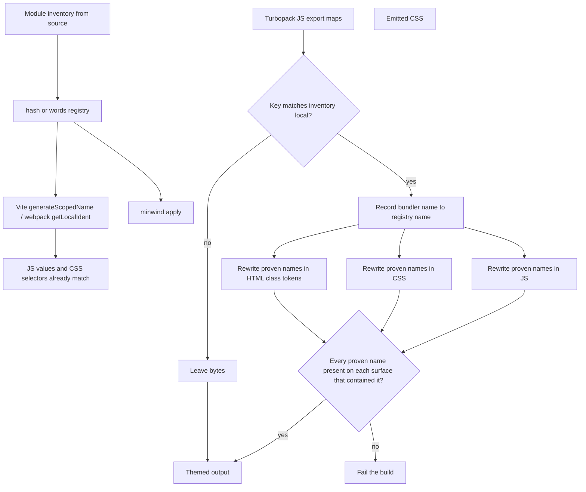

# CSS and SCSS Modules Themed Morph - Plan

## Goal Capsule

**Objective.** Ship CSS and SCSS Modules themed morph (`hash` or `words`) on Vite, webpack/rspack, and Turbopack, keeping `styles.local` export keys, in a major version that breaks the apply contract so Modules is a valid apply engine.

**Authority.** `AGENTS.md` invariants and `docs/architecture.md` outrank this plan on safety. Public fit claims live in `README.md`. Later work lives in [docs/backlog.md](../backlog.md). Surrounding engines and atomic compression are not active scope.

**Done when.** A Modules `words` fixture matches JS export values to CSS selectors on Vite, on webpack or rspack, and on a real Next/Turbopack production build after `minwind apply`. `quotes` plus the Modules engine is a hard error. Unprovable apply strings stay original. `pnpm check` is green. README and architecture describe apply/Turbopack Modules support.

**Stop if.** Remap would have to guess at hash-shaped strings, or a real Turbopack build cannot prove export-map identity without reconstructing Lightning CSS's naming pattern.

**Execution.** Test-first at the apply remap and Turbopack fixture boundaries. New TypeScript uses `function` expressions, not arrow functions.

**Tail.** Docs and versioning land in U5. Abandoned fixture or Next pin experiments are removed before done.

**Out.** Atomic Modules compression; StyleX / Vanilla Extract / Panda; indented `*.module.sass`; `quotes` as a supported Modules strategy; reconstructing Turbopack's class-name pattern.

**Product Contract preservation.** Restructured, no scope change: OQ1 → KTD1; OQ2 → KTD4; OQ3 → KTD3; AE6 citation re-pointed from OQ3 to KTD3.

---

## Product Contract

### Summary

Production CSS/SCSS Modules get the same themed class names on Vite, webpack/rspack, and Turbopack, with source-local export keys.
Vite and webpack own the name generator; Turbopack remaps after emit.
Naming is `hash` or `words` only.

### Problem Frame

The current Modules path morphs on Vite and webpack via the bundler's scoped-name hook.
Turbopack has no equivalent callback, and `minwind apply` rejects the Modules engine, so a Turbopack app cannot theme Module class names.
`quotes` is not ready to stand beside `hash` and `words`.
Authors who want a themed production DOM on CSS Modules are stuck on hook-capable bundlers or hashed names they did not choose.

### Key Decisions

- **Themed morph is the version, not atomic decomposition.** (session-settled: user-directed — chosen over atomic + rewrite-call-sites as the version goal: smallest shippable Modules story)
  Governs R10.
- **Export keys stay `styles.local`.** (session-settled: user-directed — chosen over rewriting call sites to atomic names: keep the CSS Modules JS API)
  Governs R3.
- **Hook where the bundler allows it; post-build remap for Turbopack.** (session-settled: user-approved — chosen over hash-only Turbopack or dropping Turbopack Modules theming: theming must work without a Turbopack callback)
  Governs R4, R5, R6.
- **Public naming is `hash` or `words`; `quotes` waits.** (session-settled: user-directed — chosen over keeping `quotes` in the version: do not ship a half-finished strategy)
  Governs R7.
- **Track later work in both this plan and [docs/backlog.md](../backlog.md).** (session-settled: user-directed — chosen over plan-only or doc-only tracking)
  Governs R12.
- **File coverage is CSS and SCSS Modules only.** (session-settled: user-directed — chosen over treating indented Sass as a third engine)
  Governs R1.

<!-- ce-section: work-relationships -->

### How This Work Fits Together

This plan owns **CSS/SCSS Modules themed morph across Vite, webpack/rspack, and Turbopack**.
The broader engine list from the opening request is the current understanding, not a committed roadmap.

- Atomic Modules compression
  - Depends on a stable Modules rename altitude (this plan)
  - Can proceed independently of StyleX / Vanilla Extract / Panda
- StyleX, Vanilla Extract, Panda
  - Can proceed independently of this plan's Turbopack remap
  - Shares the bijective registry and `hash`/`words` naming product
- `quotes` revival and extra hash variants
  - Shares the naming surface this plan narrows
  - Can proceed independently of Turbopack remap once `hash`/`words` are honest

### Actors

- A1. App developer integrating minwind on Vite, webpack/rspack, or Turbopack.
- A2. Production-build consumer (browser) — must see matching JS export values and CSS selectors.
- A3. Debugger of production CSS — reads themed or hashed class names, still keyed as `styles.local` in source.

### Key Flows

- F1. Vite or webpack/rspack production build with Modules + `words`.
  - **Trigger:** Production build, Modules engine on, `naming.strategy` is `words`.
  - **Actors:** A1, A2
  - **Steps:** Inventory CSS/SCSS Module locals; deal vocabulary names; name generator emits those names; JS export values match CSS selectors; keys stay source locals.
  - **Covered by:** R1, R3, R4, R7, R8, R9
- F2. Turbopack production build with Modules + `words`.
  - **Trigger:** Production build on a bundler without a name-generator hook.
  - **Actors:** A1, A2
  - **Steps:** Bundler emits its own scoped names; post-build remap rewrites proven Module names in JS, CSS, and HTML class tokens to the same registry as F1; unprovable strings stay original.
  - **Covered by:** R3, R5, R6, R7, R8, R9
- F3. Dual Tailwind + Modules, morph mode.
  - **Trigger:** Both engines on, mode morph.
  - **Actors:** A1, A2
  - **Steps:** Tailwind tokens and Module locals share one generated-name collision space; Module assets do not fail a Tailwind utilities-layer gate; `styles.local` keys unchanged.
  - **Covered by:** R2, R3, R9, R10

### Requirements

**Coverage**

- R1. CSS Modules and SCSS Modules (`*.module.css` / `*.module.scss`) are the in-scope Module files on production builds.
- R2. Tailwind remains available in the same build; dual-stack morph does not require dropping one engine.

**Identity and naming**

- R3. Export keys remain source local names; generated names appear as export values and as CSS selectors.
- R4. Vite and webpack/rspack production builds assign Module generated names through the bundler's scoped-name generator so JS and CSS stay in sync by construction.
- R5. Turbopack and other apply-class bundlers remap already-emitted scoped names onto the same registry, using the Modules engine and the same `hash` / `words` naming config as the plugins.
- R6. If a post-build string cannot be proven to be a Module generated name, it keeps its original bytes; partial remap of a token still fails the build.
- R7. User-facing Module naming is `hash` or `words`; `quotes` is not a supported Module strategy.
- R8. `words` requires a complete Module inventory and fails closed if SCSS Modules exist and Sass cannot compile them.

**Safety and mode**

- R9. Renamed surfaces share one bijective registry; collisions fail the build.
- R10. Morph mode does not consolidate Module stylesheets.
- R11. Development output stays unmorphed.

**Tracking**

- R12. Later product work is listed in [docs/backlog.md](../backlog.md) and in Scope Boundaries below; those two lists stay aligned. Engineering follow-ups in Deferred to Follow-Up Work are plan-local and are not copied into the backlog unless they become product later-work.

### Acceptance Examples

- AE1. Vite PostCSS Modules with `words`.
  - **Covers:** F1, R3, R4, R7, R8
  - **Given:** `Button.module.css` exports `root` and `naming.strategy` is `words`.
  - **Then:** `styles.root` key remains `root`; the value equals the scoped class in emitted CSS and is a vocabulary word.
- AE2. webpack/rspack Modules production build under morph.
  - **Covers:** R3, R4
  - **Then:** JS export values match CSS selectors. Hash naming is sufficient for this example. F1 `words` on webpack is owned by U3.
- AE3. Real Next/Turbopack production build, then apply, with `words`.
  - **Covers:** F2, R3, R5, R7, R8
  - **Then:** After remap, JS export values match CSS selectors and use vocabulary names; keys remain source locals. Hand-written apply fixtures do not satisfy this example (KTD6).
- AE4. Unprovable Turbopack string.
  - **Covers:** R6
  - **Then:** A string that cannot be proven as a Module local is unchanged; the build does not invent a themed name for it.
- AE5. Dual Tailwind + Modules morph.
  - **Covers:** F3, R2, R9, R10
  - **Then:** A Module local named `flex` and Tailwind `flex` get distinct generated names; Module CSS without `@layer utilities` does not fail the Tailwind layer gate.
- AE6. `quotes` with Modules.
  - **Covers:** R7
  - **Then:** Configuring `quotes` with the Modules engine is a hard error (KTD3). It does not silently hash.
- AE7. Development.
  - **Covers:** R11
  - **Then:** A Vite or webpack dev server does not install the morphing generator.

### Success Criteria

- A Modules fixture themed with `words` matches JS values to CSS selectors on Vite, on webpack or rspack, and on a real Next/Turbopack production build after `minwind apply`.
- `pnpm check` is green.
- README fit matrix lists CSS/SCSS Modules on Vite, webpack/rspack, and apply/Turbopack, and does not claim `quotes` for Modules.
- If no Modules harness site is added, README states that browser compare is N/A for Modules.

### Scope Boundaries

**In scope**

- Per R1, R4, R5: CSS/SCSS Modules themed morph on Vite, webpack/rspack, and Turbopack.
- Per R7: `hash` and `words` only.
- Per R5: major-version change so apply accepts the Modules engine and naming config.
- Per R2: dual-stack coexistence with Tailwind under morph.

**Deferred for later** (also [docs/backlog.md](../backlog.md))

- `quotes` until the strategy is good enough to ship.
- Additional hash variants.
- Atomic decomposition of Modules into shared utilities.
- Rewriting call sites away from `styles.local`.
- StyleX, Vanilla Extract, Panda.
- Indented `*.module.sass`.
- Lightning CSS Modules parity beyond fail-loud when the hook cannot be applied.
- SFC `<style module>` if it needs a different altitude than `*.module.*`.

**Outside this product's identity**

- Guessing dynamic class references.
- Becoming a general CSS minifier.
- Runtime styling libraries.

### Dependencies / Assumptions

- No observed customer workaround was captured; this is a product-completeness bet for a major version.
- Turbopack remains an apply-class bundler (no Modules name-generator callback).
- `README.md` already says Turbopack uses apply; `docs/architecture.md` currently states Tailwind-only apply and does not name Turbopack — public docs update with this version.
- Optional peer `sass` remains required to inventory SCSS Modules for `words`.
- webpack and rspack share one plugin adapter.

### Sources / Research

- Prior milestone: [docs/plans/2026-08-12-001-feat-multi-engine-styling-plan.md](./2026-08-12-001-feat-multi-engine-styling-plan.md) (hook-based morph; apply Modules unsupported; atomic out).
- Standing later list: [docs/backlog.md](../backlog.md).
- Engine stubs: [docs/engines-followups.md](../engines-followups.md).
- Safety model: [docs/architecture.md](../architecture.md), [AGENTS.md](../../AGENTS.md).
- Turbopack emit: Next.js 16 uses Lightning CSS for Modules (`File-module-scss-module__HASH__local` shape). There is no public name-generator callback. Export keys can follow `exportLocalsConvention`; generated CSS class strings remain a black box. Proof therefore cannot reconstruct that pattern.

---

## Planning Contract

### Key Technical Decisions

- KTD1. **Prove Module names from CSS Module JS export maps, then rewrite every whole-word occurrence of those proven bundler names in JS, CSS, and HTML.** An object is a Module export map only when its keys uniquely identify one inventory file (exact local-set match, else a unique subset). Ignore non-unique objects (KTD8). For each key, the bundler name is the first whitespace-separated token of the string value; later tokens are composed names resolved from other keys' primary names. Record primary pairs as bundler name → `registry.nameFor(moduleLocalKey(root, file, local))`. Do not reconstruct Turbopack or Lightning CSS hash patterns. (session-settled: user-approved — chosen over reconstructing bundler hash patterns: R6 forbids guessing)
  Instantiates R5, R6.
- KTD2. **Apply accepts the Modules engine and `hash` / `words` naming via CLI flags, not `resolveFlags`.** Flags: `--naming hash|words` (default hash) and `--vocabulary <path>` (JSON string array, required when `words`). Tailwind-only apply without those flags stays hash-only. Registry construction is U1; remapping the output directory is U2.
  Instantiates R5, R7, R8.
- KTD3. **`quotes` plus the Modules engine is a hard error** on Vite, webpack/rspack, and apply. (resolves former OQ3)
  Instantiates R7. Covers AE6.
- KTD4. **`words` inventory is compiled class selectors per `*.module.css` / `*.module.scss` file.** Sass `@use` / `@forward` locals appear only if they survive compilation as selectors in that file. A hook-time local missing from inventory still fails (`MODULES_WORDS_UNKNOWN_ERROR`). (resolves former OQ2)
  Instantiates R8.
- KTD5. **webpack dual-stack shares `NameCollisionSpace` the way Vite already does.** Create the space on the `MinwindWebpackPlugin` instance in the constructor. Seed it from `prepass.registry` in `beforeCompile` when both engines are on. Dual-stack snippet: `createGetLocalIdent(root, { collision: plugin.collision })` on that same instance. Do not auto-inject loader options. (session-settled: user-approved — chosen over leaving webpack collision as docs-only)
  Instantiates R9. Covers AE5 on webpack.
- KTD6. **AE3 is proven by a real Next/Turbopack production build, then apply.** Unit tests of the remap helper may use hand-written export maps. They do not replace the Turbopack e2e. (session-settled: user-directed — chosen over a synthetic apply-only fixture)
  Instantiates R5. Covers AE3.
- KTD7. **Modules apply is an inverse rename.** Bundler-emitted name → registry name. Do not run Tailwind `transformStylesheet` as if Module CSS still contained source locals.
  Instantiates R5, R6.
- KTD8. **A CSS Module with no provable JS export map stays original.** Once a name is proven, JS and CSS must both contain it after remap or the build fails. HTML class tokens rewrite when present; missing HTML is not a partial remap.
  Instantiates R6. Covers AE4.

### High-Level Technical Design

Hook-capable bundlers keep today's generator. Apply-class bundlers emit foreign names; apply collects proven pairs, then rewrites.

### Assumptions

- Next.js production Turbopack remains without a Modules `generateScopedName` callback through the pinned Next version.
- CSS Module export maps remain parseable in production JS (object literals or equivalent local-to-string tables). If a minifier erases that shape, those names are unprovable per KTD8.
- `pnpm compare` stays Tailwind-only unless a Modules harness is added; README states N/A.

### Implementation Constraints

- New TypeScript uses `function` expressions, not arrow functions.
- Do not auto-inject webpack `getLocalIdent` into the user's loader config. Own collision on the plugin instance and the existing `createGetLocalIdent` helper.
- Do not extend `transform-bundle.ts` class/className rewriting to guess Module hashes.
- Lightning CSS Modules on Vite stays fail-loud (`LIGHTNING_MODULES_ERROR`).
- Breaking apply CLI: `--engines css-modules` becomes valid; `--naming` and `--vocabulary` are required for `words`. Bump the public version for that break.

### Sequencing

U1 (apply contract + quotes error) → U2 (remap) → U3 (dual-stack) → U4 (Turbopack e2e) → U5 (docs).
U3 depends on U1 and U2. U4 depends on U2. U5 last.

---

## Implementation Units

### U1. Apply contract and quotes rejection

- **Goal:** Apply accepts the Modules engine with `hash` or `words`. Every adapter hard-errors `quotes` when Modules is on.
- **Requirements:** R5, R7, R8, R11. KTD2, KTD3, KTD4.
- **Dependencies:** none
- **Files:** `src/apply-cli.ts`, `src/apply.ts`, `src/flags.ts`, `src/plugin.ts`, `src/webpack.ts`, `src/engines/css-modules.ts`, `test/apply.test.ts`, `test/plugin.test.ts`, `test/webpack.test.ts`
- **Approach:**
  1. Remove `rejectApplyModulesEngine` as a blanket error. Parse `--engines css-modules`.
  2. Add `--naming hash|words` (default hash) and `--vocabulary <path>` (JSON string array). Require `--vocabulary` when `words`.
  3. When Modules is on and strategy is `words`, call `prepareModulesNaming` against `--root` with that naming config (KTD4 compiled selectors).
  4. When Modules is on and strategy is `quotes`, throw a shared error constant from Vite config, webpack `createGetLocalIdent`, and apply CLI.
  5. Tailwind-only apply without naming flags stays hash-only as today. Do not remap the output directory in this unit.
- **Patterns to follow:** `resolveFlags` in `src/flags.ts`; `APPLY_MODULES_ERROR` replacement; existing apply `--engines` parse in `src/apply-cli.ts`.
- **Test scenarios:**
  - Covers AE6. `--engines css-modules` with `quotes` exits non-zero and does not rewrite.
  - `--engines css-modules` with `hash` no longer hits the old "does not support the CSS Modules engine" message.
  - `--engines css-modules --naming words` without `--vocabulary` exits non-zero.
  - `--engines css-modules` with `words` and SCSS Modules present without `sass` fails closed (R8).
  - A `words` inventory uses compiled class selectors; a local missing from inventory fails closed (KTD4).
  - Vite plugin with Modules + `quotes` throws at config time.
  - webpack `createGetLocalIdent` with Modules + `quotes` throws.
  - Tailwind-only apply without naming flags still hashes.
- **Verification:** Apply Modules rejection tests are inverted. Quotes+Modules fails on all three adapters. Dev servers still skip morph (AE7 unchanged).

### U2. Post-build Modules remap

- **Goal:** Rewrite proven bundler-emitted Module names in JS, CSS, and HTML onto the registry. Leave unprovable strings. Fail partial remaps per KTD8.
- **Requirements:** R3, R5, R6, R10. KTD1, KTD7, KTD8. F2. AE3, AE4.
- **Dependencies:** U1
- **Files:** `src/engines/css-modules.ts` or a sibling remap module, `src/apply.ts`, `src/transform-bundle.ts` (only if a dedicated pass is cleaner than a sibling), `test/apply.test.ts`, `test/engines/css-modules.test.ts`
- **Approach:**
  1. Walk JS assets for objects whose keys uniquely identify one inventory file (KTD1).
  2. For each key, take the first whitespace-separated token as that local's bundler name. Later tokens are composed names resolved from other keys' primary names.
  3. Map each primary bundler name to `registry.nameFor(moduleLocalKey(root, file, local))`.
  4. Rewrite every whole-word occurrence of those proven bundler names in JS, CSS, and HTML (SSR markup). Do not treat Tailwind `class` / `className` source tokens as Module names.
  5. Per KTD8: no export map → leave original. Proven name missing from JS or CSS after remap → fail. Missing HTML is not a fail.
  6. Morph-only: do not consolidate Module stylesheets (R10).
- **Execution note:** Start with failing unit tests on hand-written export maps and CSS, then the apply directory walk.
- **Patterns to follow:** Conservative apply JS pass in `src/transform-bundle.ts` (literals only). Inverse of `transformStylesheet` (source token → name). `NameCollisionSpace` fail-loud. `formatModuleKey` in errors.
- **Test scenarios:**
  - Hand-written `exports = { root: "Button-module__abc__root" }` plus `.Button-module__abc__root{color:red}` remaps both to the same registry name; key stays `root`. Does not satisfy AE3 (KTD6).
  - Covers AE4. A hash-shaped string that is not an export value is unchanged.
  - Two files both exporting `root`: only an object whose keys uniquely match one file is proven; a non-unique object is ignored.
  - JS export value `"bundlerA bundlerB"`: first token is the local's name; the second resolves from another key's primary name.
  - Proven name in JS and CSS also remaps the same token in HTML `class` attributes when HTML is present.
  - Proven name in JS with no matching CSS class fails the build.
  - CSS class with no JS export map stays original (does not fail).
  - Export object whose keys are not inventory locals is ignored.
  - `words` apply remaps to vocabulary names, not hashes.
- **Verification:** Unit remap tests pass under `MINWIND_SKIP_BUILD`. Apply directory rewrite uses the same helper.

### U3. Dual-stack collision on apply and webpack

- **Goal:** Tailwind tokens and Module locals share one generated-name space on apply and on webpack/rspack.
- **Requirements:** R2, R9, R10. KTD5. F3. AE5.
- **Dependencies:** U1, U2
- **Files:** `src/apply.ts`, `src/apply-cli.ts`, `src/webpack.ts`, `test/apply.test.ts`, `test/webpack.test.ts`, `test/fixtures/dual-site/` as needed
- **Approach:**
  1. Dual-engine apply: run Tailwind prepass and Modules registry; seed `NameCollisionSpace` from Tailwind; claim Module names into the same space; run Tailwind apply then Modules remap.
  2. webpack: construct `NameCollisionSpace` on the plugin instance; seed from `prepass.registry` in `beforeCompile` when both engines are on; document `createGetLocalIdent(root, { collision: plugin.collision })`.
  3. Dual-stack compress still consolidates Tailwind only; Modules stay morph (existing coerce).
- **Patterns to follow:** Vite `collision.seed(prepass.registry)` in `src/plugin.ts`. Dual-site fixture `test/fixtures/dual-site/`. Utilities-layer skip for Module CSS in `src/transform-css.ts`.
- **Test scenarios:**
  - Covers AE5. Apply dual-stack: Module local `flex` and Tailwind `flex` get distinct generated names.
  - Covers F1 / AE2. webpack dual-stack with `words`: Module export values are vocabulary names and collide-distinct from Tailwind.
  - Module CSS without `@layer utilities` does not fail the Tailwind layer gate.
  - Dual-stack compress does not consolidate Module stylesheets.
- **Verification:** webpack dual-stack test exists (today only Vite dual-site is covered). Apply dual-stack test exists.

### U4. Next/Turbopack production fixture

- **Goal:** Prove AE3 on a real Next production Turbopack emit, then `minwind apply`.
- **Requirements:** R5, R6, R7, R8, R11. KTD6. F2. AE3, AE4.
- **Dependencies:** U2
- **Files:** `test/fixtures/turbopack-modules-site/` (new), `test/apply.test.ts` or `test/turbopack-modules.test.ts`, fixture `package.json` pinning `next`, `react`, `react-dom`
- **Approach:**
  1. Small Next app with a CSS Module (and optionally SCSS Module) imported from a client or server component. Export keys used as `styles.local`.
  2. Pin a Next version whose production build uses Turbopack (or `next build --turbopack`). Prefer `output: "export"` so apply walks a directory of HTML, CSS, and JS.
  3. Production build, then `minwind apply` with Modules + `words` (and a `hash` case).
  4. Assert JS export values match CSS selectors and are vocabulary/hash names, not the Lightning `*-module-*__*__local` emit.
  5. Include one unprovable string (AE4) in the page that must survive.
  6. Honor `MINWIND_SKIP_BUILD`. Keep Next out of the default unit path.
- **Execution note:** This is a smoke/runtime proof, not a substitute for U2 unit tests.
- **Patterns to follow:** Vite Modules fixture `test/fixtures/modules-site/` and build-gated tests in `test/plugin.test.ts`.
- **Test scenarios:**
  - Covers AE3. After apply, `styles.root` key is `root`; value equals the CSS selector and is a `words` vocabulary name.
  - Hash strategy on the same fixture remaps to `hashClassName` / `hashModuleLocal` names.
  - Covers AE4. An unrelated hash-shaped string in the page is unchanged.
  - Dev `next dev` is not remapped (R11); this test may be skip-if-slow, but production apply must not run against a dev server output as the happy path.
- **Verification:** Full `pnpm test` (not `test:unit`) builds the fixture and apply-remaps it. Skip path stays green under `MINWIND_SKIP_BUILD`.

### U5. Public docs and version bump

- **Goal:** README, architecture, and backlog match shipped behavior. Breaking apply contract is versioned.
- **Requirements:** R5, R7, R12. Success criteria docs bullets.
- **Dependencies:** U1–U4
- **Files:** `README.md`, `docs/architecture.md`, `docs/engines-followups.md`, `docs/backlog.md`, `package.json`
- **Approach:**
  1. Fit matrix: CSS/SCSS Modules on Vite, webpack/rspack, and apply/Turbopack. `quotes` not claimed for Modules.
  2. Architecture: apply is no longer Tailwind-only; name Turbopack as an apply-class bundler; describe export-map proof (KTD1).
  3. Apply CLI help: Modules supported; naming flags; quotes error.
  4. Align [docs/backlog.md](../backlog.md) deferred list with Scope Boundaries (R12).
  5. Bump the public version for the apply break.
  6. Document that U4 may be skipped only via `MINWIND_SKIP_BUILD`.
  7. `pnpm compare` N/A for Modules unless a harness site is added.
- **Test expectation:** none -- documentation and version metadata.
- **Verification:** README examples and compatibility claims match U1–U4. Architecture no longer says apply rejects Modules.

---

## Verification Contract

| Gate              | Command / signal                              | Proves                                                   |
| ----------------- | --------------------------------------------- | -------------------------------------------------------- |
| Types and format  | `pnpm run typecheck`, `pnpm run format:check` | U1–U5                                                    |
| Unit (no bundler) | `pnpm run test:unit`                          | U1 quotes/CLI, U2 remap, U3 collision helpers            |
| Full tests        | `pnpm test`                                   | U4 Next/Turbopack e2e when not skipped                   |
| Repo check        | `pnpm check`                                  | Required before done                                     |
| Compare           | `pnpm compare`                                | Tailwind-only; N/A for Modules unless a harness is added |

---

## Definition of Done

- Every unit's test scenarios pass, or U4 is skipped only via `MINWIND_SKIP_BUILD` with that documented in README.
- AE1–AE7 have a test or a written N/A (AE1/AE2 already exist on Vite/webpack; this plan must not regress them).
- `pnpm check` is green.
- README fit matrix and architecture describe Modules on apply/Turbopack and do not claim `quotes` for Modules.
- [docs/backlog.md](../backlog.md) still matches this plan's deferred list.
- Abandoned Next pin or fixture experiments are not left in the diff.

---

## System-Wide Impact

- **Apply CLI** is a public breaking contract: `--engines css-modules` becomes valid; naming flags appear; `quotes` plus Modules errors.
- **Reports / artifacts** keep `formatModuleKey` for Module identities.
- **HTML and SSR:** Next will put bundler class names in markup. Proven-name rewrite must include HTML class tokens (KTD1), not only JS export objects and CSS.
- **webpack public helper:** Dual-stack uses `createGetLocalIdent(root, { collision: plugin.collision })` on the plugin instance (KTD5).
- **No browser runtime API change.** `styles.local` keys stay. Development output stays unmorphed.

---

## Risks & Dependencies

- **Next/Turbopack churn.** Production Turbopack and Lightning CSS Module naming are moving. Mitigation: pin Next in the fixture; KTD1 does not depend on the hash pattern.
- **Minified export maps.** If production JS no longer contains local→string tables, remap coverage collapses to KTD8 (leave original). Mitigation: U4 fails loud if the fixture's emit is unprovable; do not silently reconstruct hashes.
- **RSC / Flight payloads.** Next may duplicate class strings outside HTML and CSS Module exports. Mitigation: once a name is proven, rewrite whole-word occurrences in all JS assets, not only the export object. Strings not in the proven set stay.
- **webpack collision was a 001 gap.** Dual-stack webpack users can already collide today. U3 closes that in this version.
- Optional peer `sass` for SCSS `words` is unchanged (R8).

---

## Deferred to Follow-Up Work

- Auto-inject webpack `getLocalIdent` into the user's loader rules.
- Real Next/Turbopack in `pnpm compare`.
- Parse shapes beyond unique-file object-literal export maps if U4 reveals a stable alternate table form — only if still proof, not pattern reconstruction.
- Apply report rows for remapped Module locals matching plugin hook reports.

---

## Documentation / Operational Notes

Breaking change: `minwind apply --engines css-modules` becomes valid; `quotes` with Modules errors. Call that out in README. No new env vars. No runbook beyond apply CLI help.
